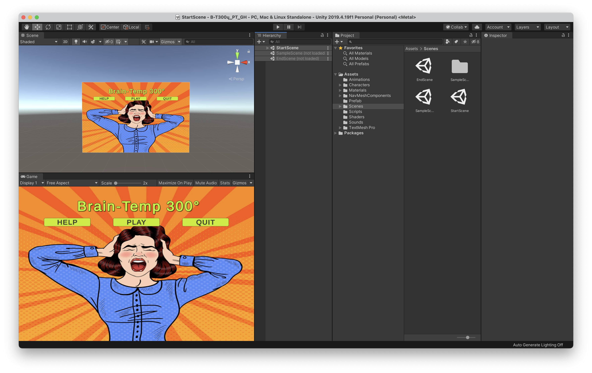
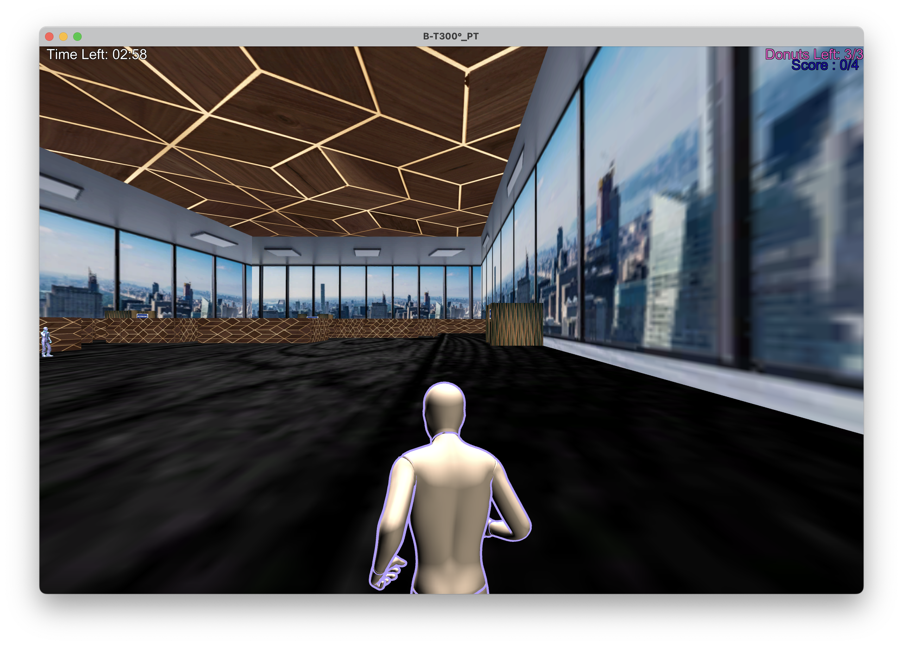

# Brain-Temp-300°
As the head boss of a design firm in New York, you hold a lot of responsibilities on your plate. One of the more important responsibilities is your awareness of the mental well being of your employees. In this game, you must seek out your fellow workers and take their brain temperature in order to ensure that they are happy and mentaly healthy. Staring at a screen for long periods of time with no social interaction or consideration from superiors can be very taxing and damaging to an individual's sanity.

## Table of contents
* [General Info](#general-info)
* [Getting Started](#getting-started)
* [How To Play](#how-to-play)
* [Technologies](#technologies)
* [Credits](#credits)
* [Visual Demonstration](#visual-demonstration)

## General info
This project is the final project for CS 426 (Video Game Design and Development) at the University of Illinois at Chicago, Spring 2021. Our task was to develop a 3D game in Unity design a 3D game that incorporates elements discussed in the course: physics, AI, shaders, and sound, and in which the player starts in a “corridor”/”location” and moves towards a “gate/door” at the end of the corridor. The gate/door can be opened using a “puzzle”. Player enters a “room/space” and looks for the “artifact” which he/she has to acquire. The player will try to avoid a “trap”.

## Getting Started
If you would like to simply play the game, you can download the [Windows](Final%20Windows%20Build/Brain-Temp%20300°/B-T300°_PT.exe) or [Mac](Final%20Mac%20Build/Brain-Temp%20300°.app/Contents/MacOS/B-T300°_PT) versions. If you would like to experiment with the environment we developed the game in, make sure you have **Unity 2019.4.19f1** installed.
* Windows: https://unity3d.com/get-unity/download?thank-you=update&download_nid=64443&os=Win
* Mac: https://unity3d.com/get-unity/download?thank-you=update&download_nid=64443&os=Mac
* Linux: https://accelerator.cloud.unity3d.com/api/v1/accelerator/download/installer?target_os=linux&download_location=lts-releases

Once you are ready, open the project with Unity and you should be good from there. Please note that it is ***strongly recommended to use Unity 2019.4.19f1*** to experiment with the game environment, as support is not guaranteed with other versions. You can, however, take a look at the scripts in your IDE or editor of choice. Once you open up the project, it should look something like the image above.

## How To Play

The game is simple enough to play (but tricky to beat!) and instructions are provided in the help menu upon loading the game. They will also be referenced here: 
* **Controls:** W, A, S, D to move forward, view left, move backward, and view right accordingly. Space is to jump/power jump. Left click is to give out donuts.
* **Workers** may or may not have a "high temperature". There are 4 workers with a high temperature, and the rest do not. Your job is to seek out those 4 workers and give them each a donut. They are scattered throughout the office and some may be in hard to find locations.
* **Donuts** are given by left click, and may be restocked at the donut station close to the original spawn point. The player may only hold 3 donuts at one time, however, so a minimum of one restock is necessary to win.
* **Timing** is essential! You only have 3 minutes to seek out all the workers with a high temperature and give them each a donut. Good luck!
    
## Technologies
Project is created with:
* Unity version 2019.4.19f1
* C# scripts

## Credits
* **Original Concept:** [Ellie Spearman](https://github.com/elliespearman2022)
* **Project Leader:** [Ellie Spearman](https://github.com/elliespearman2022)
* **Design:** [Ellie Spearman](https://github.com/elliespearman2022), [Lloyd Morris](https://github.com/lloydm9)
* **Technical Direction:** [Abel Abraham](https://github.com/Abelaj50)
* **Development:** [Abel Abraham](https://github.com/Abelaj50), [Lloyd Morris](https://github.com/lloydm9), [Patrick Gundry](https://github.com/KirtapGeno)
* **Scripting:** [Abel Abraham](https://github.com/Abelaj50), [Lloyd Morris](https://github.com/lloydm9), [Patrick Gundry](https://github.com/KirtapGeno)
* **Audio Production:** [Abel Abraham](https://github.com/Abelaj50)

All credits to technologies used are given to their owners and all items specified in their respective licenses are adhered to throughout this project.  

## Visual Demonstration
The following link leads to a visual demonstration of the project.
* https://youtu.be/9GdFLcM8d1k

